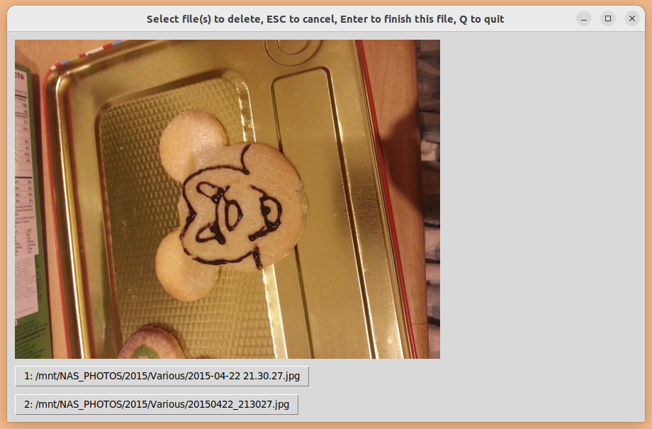

# DupeBox
Graphical helper to delete duplicate image files found by `rdfind`.

## Use case
You have used `rdfind` to generate a list of duplicate images, and you need to go through them manually and decide which to delete.

## Installation (tested on Ubuntu 22.04)

Install tkinter and PIL:

    sudo apt install python3-tk python3-pil.imagetk

## Usage

    ./dupebox.py [--random] [--worst] [filename]

where
- `--random` sorts the results randomly
- `--worst` shows you the worst offenders (most duplicates) first
- `filename` is the name of the rdfind output. Defaults to results.txt if omitted.

The program will display, for each group of duplicate pictures, the picture a button per duplicate file. Press one or more of the buttons to mark files for deletion. Keyboard shortcuts (<kbd>1</kbd>..<kbd>9</kbd> and <kbd>a</kbd>...) are also provided for expediency.

The program outputs a file (`delete.txt`) containing `rm` commands for each file marked for deletion. You can perform the deletion using, for example, `source deletes.txt`.

